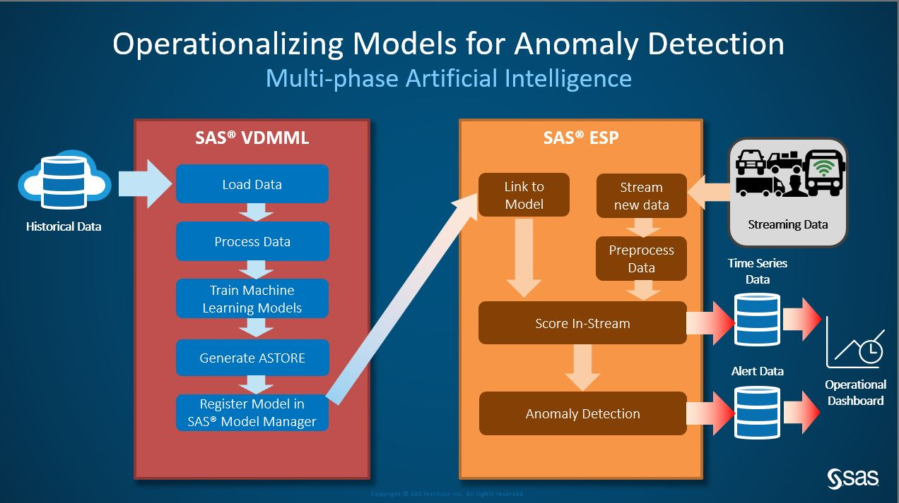
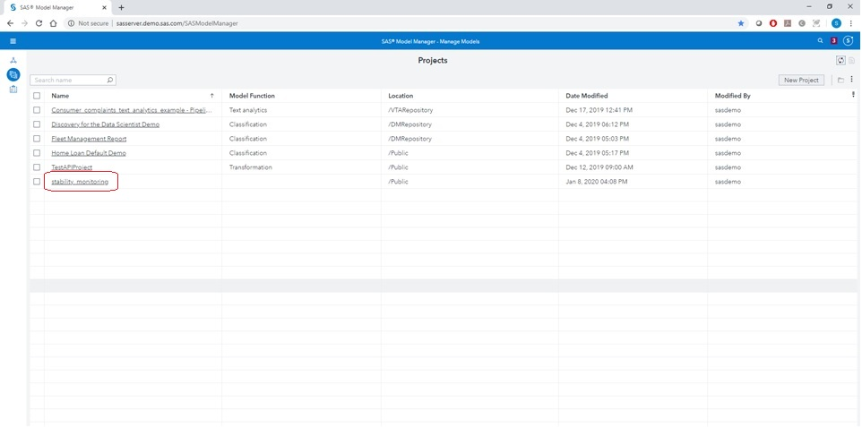
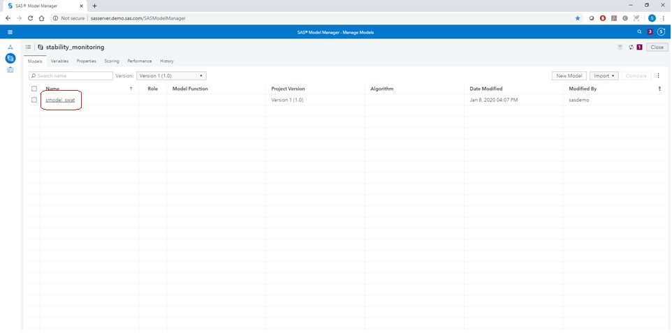
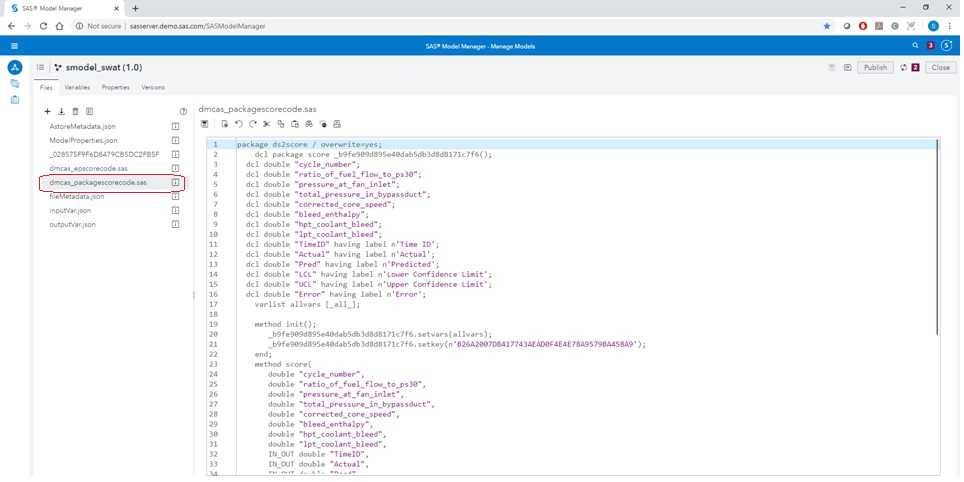
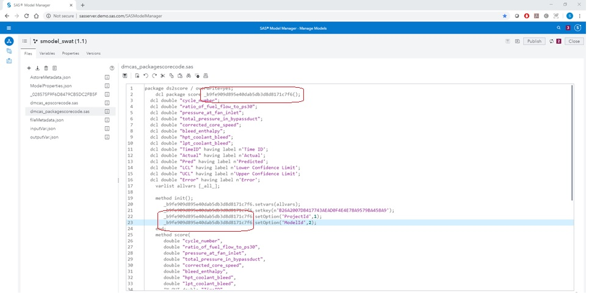
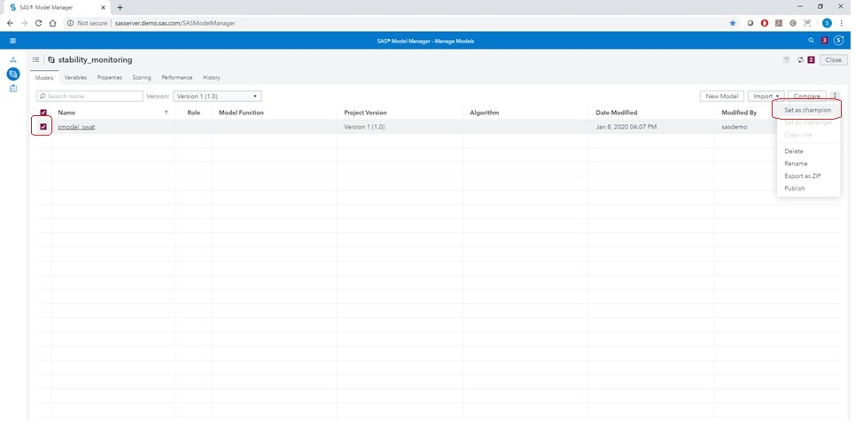
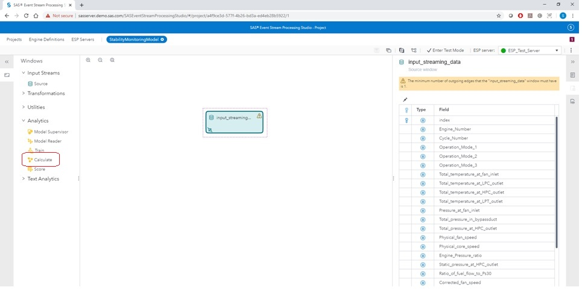
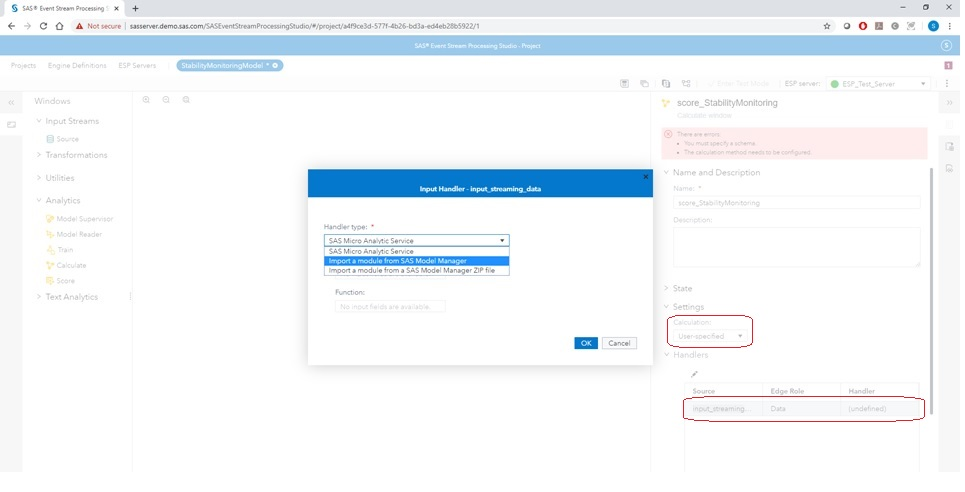
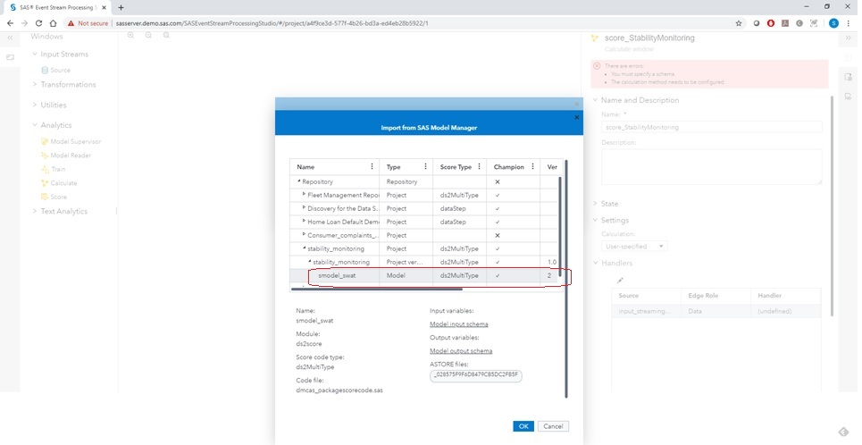

# Demonstration of Real Time Stability Monitoring with SAS Viya and SAS Event Stream Processing (ESP)

## Table of Contents
- [Demonstration of Real Time Stability Monitoring with SAS Viya and SAS Event Stream Processing (ESP)](#demonstration-of-real-time-stability-monitoring-with-sas-viya-and-sas-event-stream-processing-esp)
  - [Table of Contents](#table-of-contents)
  - [Motivation](#motivation)
  - [Background of Problem Statement](#background-of-problem-statement)
  - [Overview of Software Versions used](#overview-of-software-versions-used)
  - [Assumptions](#assumptions)
  - [Setup and execution of demo](#setup-and-execution-of-demo)
    - [SAS Viya - Creating Stability Monitoring Model](#sas-viya---creating-stability-monitoring-model)
    - [SAS Viya - Model Manager](#sas-viya---model-manager)
      - [SAS Model Manager Process](#sas-model-manager-process)
      - [Consuming model into ESP](#consuming-model-into-esp)
    - [Postgres Database](#postgres-database)
      - [Initialization](#initialization)
      - [Execution](#execution)
    - [Grafana](#grafana)
      - [Initialization](#initialization-1)
    - [SAS Event Stream Processing](#sas-event-stream-processing)
      - [Initialization](#initialization-2)

## Motivation
The motivation for this demo was to provide an end to end example showing the following

- Creating a Stability Monitoring model within SAS Studio
- Register Stability Monitor model in SAS Model Manager to be consumed in a streaming analytic via ESP
- Showcase openness of ESP by creating a real-time dashboard using open-source components such as Postgres and Grafana

The overall end to end process can be seen below.



Once this process is complete, the output will be a real-time dashboard presenting time-series data (both input and analytic outputs) and escalated alerts requiring further actions. An example of this can be seen in the video found [here](images/SGF_Aircraft_Engine.mp4).

## Background of Problem Statement
This example comes from the 2008 Prognostic Health Management (PHM) data challenge competition. The data set contains simulated results of Turbofan engine degradation across multiple engines. There are 4 data sets with various train/test trajectories included. A given data set may have 1 or more failure modes present and 1 or more operation modes present.

This challenge has been analyzed previously using SAS and Stability Monitoring models. For this reason, this demo follows the same example where training data set is used from FD003 for Engine #24 which contains a total of 494 cycles

- The first 90 cycles are used within SAS Viya for creating a stability monitoring model
- Cycles 150 through 494 are streamed to ESP that contains the stability monitoring model. 

The training and test data sets can be obtained at the link below for the PHM 2008 Turbofan Dataset Challenge. Note that the data set does not have column names associated with it. This is obtained using the publication **Damage Propagation Modeling for Aircraft Engines**, Table 2.

| **Reference**                                                |
| ------------------------------------------------------------ |
| [PHM 2008 Turbofan Dataset Challenge](https://ti.arc.nasa.gov/c/13/) |
| [Damage Propagation Modeling for Aircraft Engines](https://ti.arc.nasa.gov/publications/154/download/) |
| [Monitoring Turbofan Degradation using Stability Monitoring](https://support.sas.com/content/dam/SAS/support/en/technical-papers/iot/Monitoring-Turbofan-Engine-Degradation-Using-Stability-Monitoring-Procedures.pdf) |


## Overview of Software Versions used

| Software                    | Version       |
| --------------------------- | ------------- |
| SAS Viya                    | v3.5 19w47    |
| SAS Event Stream Processing | 6.2           |
| Linux Version               | CentOS 7      |
| Docker Engine - Community   | 19.03.5       |
| Postgres Database           | 12.1          |
| Grafana                     | 6.5.2         |


## Assumptions

This demo repository assumes the following:

- You have SAS Viya and Event Stream Processing Installed
- Docker is installed and available. If not, please search online how to do so. For Linux and obtaining the Community Version, please use the following [link](https://docs.docker.com/install/linux/docker-ce/centos/).

## Setup and execution of demo

### SAS Viya - Creating Stability Monitoring Model

`stabilityMonitoring.ipynb` - This notebook shows an end to end demonstration of using stable data to build models that help with monitoring stability. The notebook is self documented so starting there would be beneficial. The notebook can either be run against Enterprise Viya deployment or it can be run on containerized CAS. The artifacts can then be moved to the SAS Model Manager for governance/auditing/tracking & to enable seamless integration with ESP.

The key thing to remember is that you can build multiple projects within the Stablity Monitoring Calibration action and for each project, multiple models can be calibrated with appropriate inputs (including input transformations). The resulting models are stored in an ASTORE which can then be deployed to be scored in batch or real time. What happens then is that the new data (which would presumably contain both stable and unstable signals) is scored using the ASTORE which creates the predictions, UCL & LCL for those predictions. Thresholds and tolerances can then be set to drive alerts and carry out corrective actions as a follow up.

The next section will focus of what to do with the model now that it is in SAS Model Manager.

### SAS Viya - Model Manager

The stability monitoring model is now registered in SAS Model Manager. To make this model ready to be consumed by a streaming analytic, we need to do the following things:

 - SAS Model Manager - update the model options and to set the model as the champion
	- **Note:** Setting the model as champion is important as only champion models can be deployed into Event Stream Processing analytics
 - Event Stream Processing - creating link of stability monitoring model from SAS Model Manager
 
These will be covered in the sections below.
 
#### SAS Model Manager Process

Below are the steps needed to update the model options and to set the model as the champion. 

1. As you enter into SAS Model Manager, you can see all of the Models and Projects available. When going into Projects, you will see the **stability_monitoring** project present. This is accomplished in the last section of the Jupyter Notebook in the previous section.



2. Click on the project name. This will show all models associated with this project. In this case, only 1 model is present: **smodel_swat**. Click on the model name.



3. Once you clicked on the model, you will be able to see all of the associated files present for this model. The **dmcas_packagescorecode.sas** needs to be modified. This is needed because the stability monitoring ASTORE file contains multiple models and we need to specify which one we want to use. To do so, we will add *setOptions* to the score code. For this case, the options should set the ProjectId = 1, ModelId = 2 as the ARIMA model was determined to be the best model.



4. Go ahead and modify this score code to add *setOptions*. See the image below of where this needs to be set. **Note:** the first part is a reference to the score package and must match to the item above (as indicated by the red boxes).



5. Once complete, make sure to save this file. Go back into the Model Manager - Projects section. Now we will make the **smodel_swat** the champion. We do this by selecting this model and set it as the champion.



#### Consuming model into ESP

Now that the model has been updated and set as the champion, it is now ready to be consumed within ESP. Below are the steps needed. **Note:** if you are starting with the ESP model provided within this repository, all you have to do is update the Handler in the Calculate Window **scoreSMModel** to the model selected as champion. No need to change/modify schemas.

1. After you have created a new ESP project with a source window, go ahead and drag a Calculate Window and connect it to the source window.



2. In the Calculate Window, the calculation type will be *User-specified*. Below that in the section of Handlers, double click on the only item present. This will open up a window for you to select the source of the model. Go ahead and select *Import a model from SAS Model Manager*



3. After selecting this option, the SAS Model Manager repository will show. Navigate to the project **stability_monitoring** and expand to select the smodel_swat that we have set as the champion. This now creates a link between ESP and SAS Model Manager. Note that you may want to automatically create the output schema from the model.



### Postgres Database

#### Initialization

Below are the steps needing to be followed to set up the Postgres Database using Docker

1. Get latest docker image of Postgres database 

   ```sh
   docker pull postgres
   ```

2. Create directory for persistent storage of data

   ```sh
   mkdir -p $HOME/docker/volumes/postgres
   ```

3. Start docker container (**Note:** the port used here is not the default of 5432)

   ```sh
   docker run --rm   --name pg-docker -e POSTGRES_PASSWORD=docker -d -p 5433:5432 -v $HOME/docker/volumes/postgres:/var/lib/postgresql/data  postgres
   ```

4. Obtain the CONTAINERID for this Postgres Container

   ```sh
   docker container ls
   ```
   
5. Bash into the Postgres Container. This is required to create the 2 SQL Tables to hold the ESP Analytic Outputs. Make sure to update the CONTAINERID with the one found above.

   ```sh
   docker exec -it <<CONTAINERID>> bash
   ```
   
   

6. Connect into Postgres Database using Command Line

   ```sh
   psql -h localhost -p 5432 -U postgres -d postgres
   ```

7. Once in the command line for the Postgres Database, copy the commands in the files `postgres_create_alert_table.txt` and `postgres_create_time_series_table.txt`. This is where the ESP Model will push data after scoring the stability monitoring model. Grafana will use this as a data source for visualizations.

8. Quit out of the Postgres Database and Exit the Container Bash

   ```sh
   \q
   exit
   ```

   

#### Execution

Once the Postgres Database docker container has been installed and configured, the only step required is to ensure the Postgres docker image is running with the following command

```sh
docker run --rm   --name pg-docker -e POSTGRES_PASSWORD=docker -d -p 5433:5432 -v $HOME/docker/volumes/postgres:/var/lib/postgresql/data  postgres
```

### Grafana

#### Initialization

Below are the steps needing to be followed to set up the [Grafana using Docker](https://grafana.com/docs/grafana/latest/installation/docker/):

1. Create a persistent volume for your data in /var/lib/grafana (database and plugins)

   ```
   mkdir -p $HOME/docker/volumes/grafana
   ```

2. Start Grafana with your user id and using the data folder ... note the UserID is needed for the persistent volume to work

   ```
   ID=$(id -u)
   
   docker run --rm -d --user $ID --volume "$HOME/docker/volumes/grafana:/var/lib/grafana" -p 3000:3000 grafana/grafana
   ```

3. Open a Web Browser and connect to Grafana: http://IP_Address:3000 

4. In Grafana, log into the service

   1. Initially, the username/password will be <u>admin/admin</u>. Afterwards you can change the password to what you want.

5. Set up Data Source

   1. Select <u>PostgresSQL</u> as the Data Source Type

   2. Complete the following fields with the information. All other fields can remain unmodified/default. Do not change the name of the Data Source at the top (should be PostgreSQL)

      | Parameter        | Value|
      | ---------------- | ---------------------------------|
      | Host             | Hostname and Portnumber of Postgres Database|
      | Database         | postgres					         |
      | user             | postgres                          |
      | password         | docker                            |
      | SSL Mode         | disable                           |
      | Postgres Version | 10                                |
      
      

6. Set up the Dashboard

   1. On the left side menu, click on the + sign (Create), then Import. Upload the JSON file `Grafana_Dashboard.json` that is within this Github repository

### SAS Event Stream Processing

The ESP Model used for this demo is ESP_StabilityMonitoringModel_ModelManager.xml. For this use-case, the input streaming data into the ESP model is a CSV file. You will need to create this from the data set downloaded initially. Note that this assumes the execution is done within SAS ESP Studio and not standalone on the ESP Engine itself.

#### Initialization

Before executing this ESP Model, the following changes are needed:

1. Input Data Source - creation of CSV file for data set to score. After this, update the Source Window *engine24_fd003* File/Socket connection to point to this CSV file.
2. In the ESP Project, modify the window *scoreSMModel* and its Handler to point to the champion model in SAS Model Manager
3. Set up ESP to connect to the Postgres Database using [DataDirect Drivers](https://go.documentation.sas.com/?cdcId=espcdc&cdcVersion=6.2&docsetId=espca&docsetTarget=p0kqcqs0y2r24yn1c94ick5yudkh.htm&locale=en#n0feccmkew8aeyn16zullvc547nd).
   1. Edit the `odbc.ini` file from this Github repository. 
      1. Change all locations where SAS ESP is used to the demo setup. If using a standard SAS Viya installation, there should be no need to change the location.
      2. Under the DSN name **SGFESP**, change the <u>HostName</u> and <u>PortNumber</u> to running Postgres database. 
   2. Move the odbc.ini file to a location to where ESP will be able to access it
   3. Create a new Environment Variable called **ODBCINI**. This Environment Variable will point to the location of the `odbc.ini` file.
		```
		export ODBCINI=<<path to ODBC INI file>>
		```
   4. This needs to be done **before** the ESP Engine is started to ensure it can see this.
   
Go ahead and execute! After starting execution, the Grafana dashboard should start updating with analytic results.